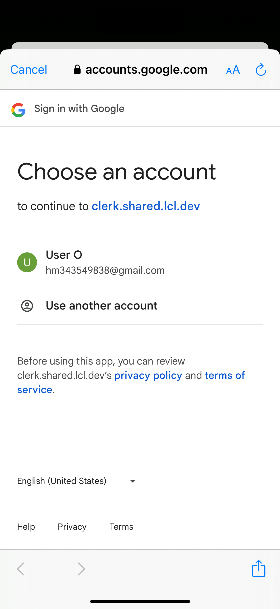

Hi!
This is my biggest project, a full-stack app called 'Supa Charge'.
With this app, you can find EV chargers, along with Google Maps to seamlessly change your location or open it in Google Maps. You can also filter the number of chargers and your search radius. Information on the address and number of chargers available is also provided. Using the cloud, the user can add or remove favorite chargers for quick access from the favorites screen. The user can create their account at the login screen to manage all this and more!

- For login and account management, I used Clerk. This gave me insights into my users, user count, and the ability to add or remove authentication services (e.g., I could add sign-in using Facebook, GitHub, etc.). I could then link the users' favorites, etc., to the user account.

- For the map, searching using the map, places (i.e., chargers in my case), and all the information on the chargers, I used the Google Maps and Places API offered by Google Cloud Services. This gave me access to Google’s amazing maps and millions of places, along with detailed info on these places like addresses, coordinates, number of chargers, etc. Google credentials also allowed my users to get authorized to use these APIs under my account using Google authentication.

- For the users’ data (i.e., users’ favorites, etc.), I used Firebase, a real-time database offered for free by Google. This gave me the ability to store and retrieve data in real time, which was perfect for user experience as they could see their favorites update in real time. Firebase also allowed me to store user data securely. Furthermore, I used the user’s Clerk email to link them to Firebase, meaning they get their favorites linked to their email. This email data is stored in Firebase along with the favorites' places data.

- This app is completely free and open-source! Download it, enjoy it, and change whatever you like—it's a free template made for your enjoyment. Please note you will have to download all dependencies using npm/npx install, and you'll need to set up your own Clerk, Google API, and Firebase accounts to use this app.

- Currently, I do not plan to put this app on the Apple App Store because they want big money! 😞 But I will put it on the Android Play Store soon!

- Here are some pictures of the app in action.
- Plus, here is a link to the app's live demo: https://youtu.be/n4j3UFxffWs.

- Login Screen:

  

- Home Screen:

     

- Favorites Screen:

- Profile Screen:

- Clerk User Authentication:

 

- Google APIs:

- Firebase Database:

 